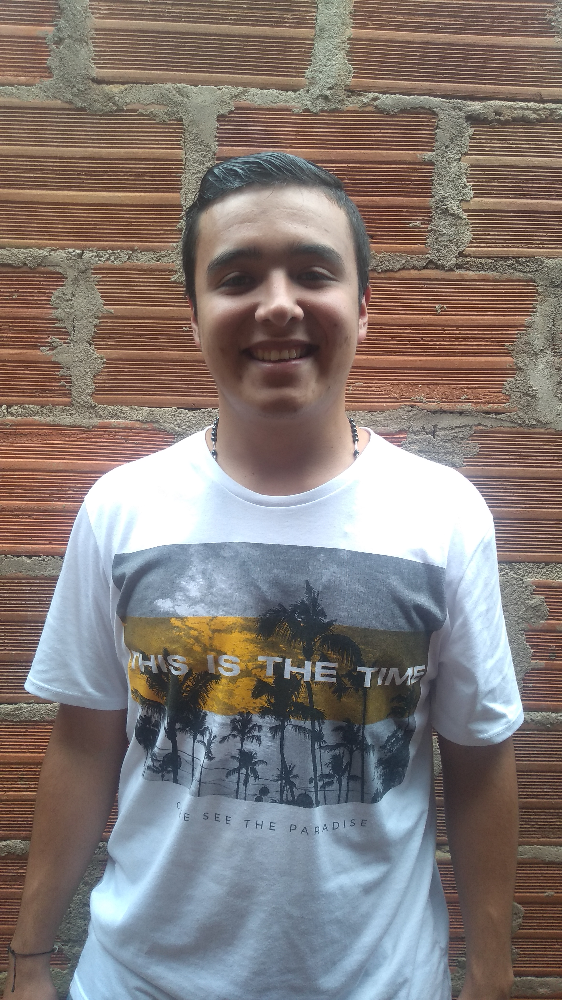

## Hola 👋 Mi nombre es Carlos Gomez

Soy desarrollador Frontend amante de la programación y el diseño.

 

 

 

 

## Sobre Mi

- 🔭 Actualmente estoy buscando trabajo.
- 🌱 Estoy usando [React](https://reactjs.org).
- 💬 Empezando a crear contenido en [Twitch](https://twitch.gonzalopozzo.com).

 

## Languages and Tools
<code></code>
<code></code>
<code></code>
<code></code>
<code></code>
<code></code>

---

